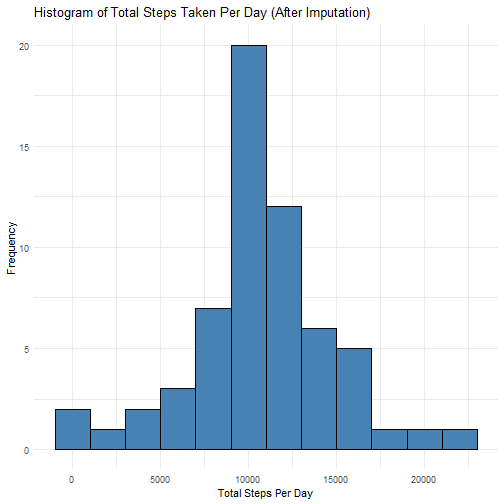

## Introduction

This report analyzes data from a personal activity monitoring device that collects data at 5-minute intervals throughout the day. The data consists of two months of data from an anonymous individual collected during October and November 2012.

## Loading and preprocessing the data


``` r
library(ggplot2)
library(dplyr)
```

```
## 
## Attaching package: 'dplyr'
```

```
## The following objects are masked from 'package:stats':
## 
##     filter, lag
```

```
## The following objects are masked from 'package:base':
## 
##     intersect, setdiff, setequal, union
```

``` r
library(lubridate)
```

```
## 
## Attaching package: 'lubridate'
```

```
## The following objects are masked from 'package:base':
## 
##     date, intersect, setdiff, union
```

``` r
activity <- read.csv("activity.csv", stringsAsFactors = FALSE)

activity$date <- as.Date(activity$date)

head(activity)
```

```
##   steps       date interval
## 1    NA 2012-10-01        0
## 2    NA 2012-10-01        5
## 3    NA 2012-10-01       10
## 4    NA 2012-10-01       15
## 5    NA 2012-10-01       20
## 6    NA 2012-10-01       25
```

## What is mean total number of steps taken per day?


``` r
# Calculate total steps per day
daily_steps <- activity |> 
  group_by(date) |> 
  summarize(total_steps = sum(steps, na.rm = TRUE))

# Create histogram of total steps per day
ggplot(daily_steps, aes(x = total_steps)) +
  geom_histogram(binwidth = 2000, fill = "steelblue", color = "black") +
  labs(title = "Histogram of Total Steps Taken Per Day",
       x = "Total Steps Per Day",
       y = "Frequency") +
  theme_minimal()
```


``` r
# Calculate mean and median
mean(daily_steps$total_steps, na.rm = TRUE)
```

```
## [1] 9354.23
```

``` r
median(daily_steps$total_steps, na.rm = TRUE)
```

```
## [1] 10395
```

The mean number of steps taken per day is 9354.23 and the median is 10395.

## What is the average daily activity pattern?


``` r
# Calculate average steps per interval
interval_avg <- activity |> 
  group_by(interval) |> 
  summarize(avg_steps = mean(steps, na.rm = TRUE))

# Create time series plot
ggplot(interval_avg, aes(x = interval, y = avg_steps)) +
  geom_line(color = "steelblue") +
  labs(title = "Average Daily Activity Pattern",
       x = "5-minute Interval",
       y = "Average Number of Steps") +
  theme_minimal()
```


``` r
# Find interval with maximum average steps
interval_avg[which.max(interval_avg$avg_steps), ]
```

```
## # A tibble: 1 × 2
##   interval avg_steps
##      <int>     <dbl>
## 1      835      206.
```

The 5-minute interval that, on average, contains the maximum number of steps is 835 with 206 steps.

## Imputing missing values


``` r
# Calculate total number of missing values
sum(is.na(activity$steps))
```

```
## [1] 2304
```

There are 2304 missing values in the dataset.

I'll use the mean for that 5-minute interval to fill in missing values:


``` r
# Create a new dataset with imputed values
activity_imputed <- activity |> 
  group_by(interval) |> 
  mutate(steps = ifelse(is.na(steps), mean(steps, na.rm = TRUE), steps)) |> 
  ungroup()

# Calculate total steps per day with imputed data
daily_steps_imputed <- activity_imputed |> 
  group_by(date) |> 
  summarize(total_steps = sum(steps))

# Create histogram
ggplot(daily_steps_imputed, aes(x = total_steps)) +
  geom_histogram(binwidth = 2000, fill = "steelblue", color = "black") +
  labs(title = "Histogram of Total Steps Taken Per Day (After Imputation)",
       x = "Total Steps Per Day",
       y = "Frequency") +
  theme_minimal()
```



``` r
# Calculate mean and median with imputed data
mean(daily_steps_imputed$total_steps)
```

```
## [1] 10766.19
```

``` r
median(daily_steps_imputed$total_steps)
```

```
## [1] 10766.19
```

After imputation, the mean number of steps taken per day is 10766.19 and the median is 10766.19.

The impact of imputing missing data:

* The mean increased from 9354.23 to 10766.19.

* The median increased from 10395 to 10766.19.

* Mean and median are now equal after imputation.

## Are there differences in activity patterns between weekdays and weekends?


``` r
# Create factor variable for weekday/weekend
activity_imputed <- activity_imputed |> 
  mutate(day_type = ifelse(weekdays(date) %in% c("Saturday", "Sunday"), 
                          "Weekend", "Weekday")) |> 
  mutate(day_type = as.factor(day_type))

# Calculate average steps per interval by day type
interval_avg_daytype <- activity_imputed |> 
  group_by(interval, day_type) |> 
  summarize(avg_steps = mean(steps))
```

```
## `summarise()` has grouped output by 'interval'. You can override using the `.groups`
## argument.
```

``` r
# Create panel plot
ggplot(interval_avg_daytype, aes(x = interval, y = avg_steps)) +
  geom_line(color = "steelblue", linewidth = 0.8) +
  facet_wrap(~ day_type, ncol = 1, strip.position = "top") +
  labs(title = "Average Steps by 5-minute Interval: Weekdays vs. Weekends",
       x = "5-minute Interval",
       y = "Average Number of Steps") +
  theme_minimal(base_size = 12) +
  theme(
    strip.background = element_rect(fill = "lightblue", color = "black"),
    strip.text = element_text(face = "bold", size = 12),
    panel.spacing = unit(1, "lines"),
    plot.title = element_text(hjust = 0.5, face = "bold"),
    strip.placement = "outside"
  ) +
  scale_x_continuous(breaks = seq(0, 2400, by = 400))
```


The activity patterns show clear differences between weekdays and weekends:

* On weekdays, there's a pronounced peak in activity around the 835 interval (morning).

* On weekends, activity is more distributed throughout the day.

* Weekend mornings show lower activity peaks compared to weekdays.

* Afternoon and evening activity tends to be higher on weekends.
